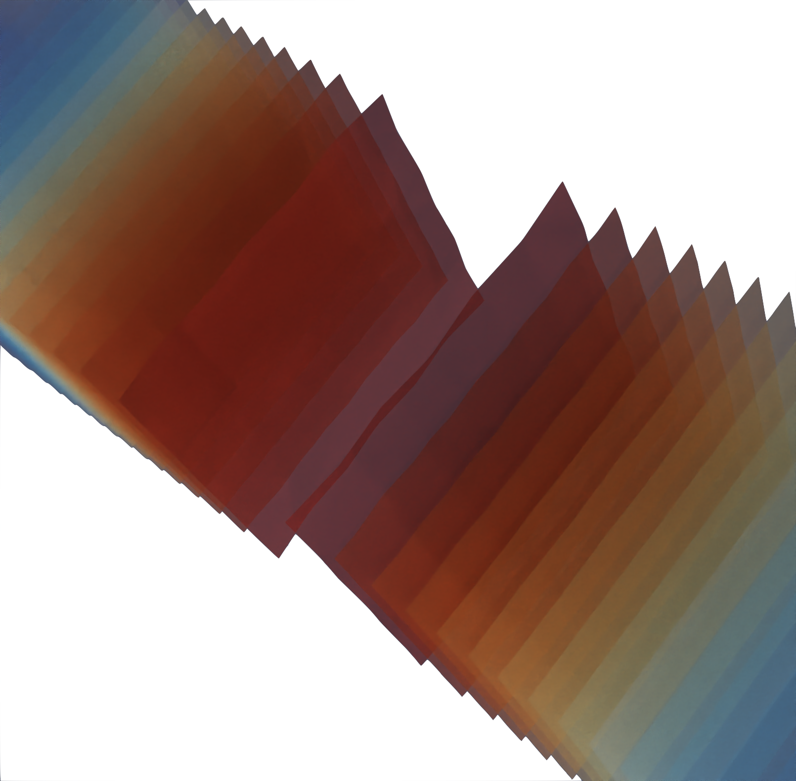
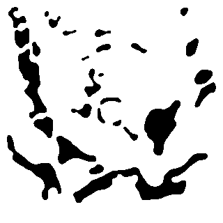

#+title: Open Source Tools for Finite Element Analysis
#+author: Martín Rodriguez
#+date: <2025-12-18 Thu>
#+setupfile: "../../../assets/org/export_setup.org"
#+cite_export: csl "../../../assets/csl/ieee.csl"
#+bibliography: references.bib

#+ATTR_HTML: :width 300px
#+ATTR_HTML: :align center
#+ATTR_ORG: :align center
#+CAPTION: Output of FEniCSx solver captured using raymarching in ParaView.
#+NAME: fig:intro

Github link: [[https://github.com/mtrpdx/aurora][https://github.com/mtrpdx/aurora]]

NOTICE: This article is a work-in-progress as I experiment with Org mode > LaTeX > HTML output.

* Introduction

I recently got in the habit of browsing the [[https://www.darpa.mil/work-with-us/opportunities][DARPA solicitations]] from time to time. I came across a solicitation for a study on the feasibility of ``Acoustic-based UAS Rainbow Oscillation Refraction Architecture," and I became intrigued. There was a link to a 2025 Science article [cite:@christiansen2025morphogenesis] that describes a method of designing homogeneous 3D structures for desired acoustic properties through the power of applied topological optimization techniques. Christiansen et al. show that they were able to use these designed structures to separate wide-bandwidth noise into spatially-separated frequency bands at above-unity efficiency. The DARPA solicitation asked if this technique could be applied to drone noise, and specifically, could it be used to design structures or materials that could help drones communicate information like position or velocity with each other passively through the spatial separation and direction of their broadband propeller noise? 

* Methodology

The first step is to reproduce the results in [cite:@christiansen2025morphogenesis]. The supplemental materials provide a .png image of the bitmap acoustic rainbow emitter (ARE) structure (Figure [[fig:ARE-design]]). This design is created iteratively through 2D topological optimization, with distance from the desired acoustic properties used as a loss function. The 2D optimal design (optimal in the sense that it optimally minimizes some loss function, or that it optimally solves some problem for a specific class of functions, not that it is the only possible structure) is then extruded and used for 3D simulation, additive manufacturing (3D printing) and physical measurement in an anechoic environment. Simulation is performed via a finite element analysis solver in COMSOL Multiphysics. Seeking open source alternatives, I open a browser window and search for finite element analysis software [cite:@wiki_fea_software;@scicomp_stack;@feacompare].

Unfortunately, what might have been a fairly straightforward simulation in COMSOL becomes an increasingly deep rabbit hole. A flash of consciousness. I look at the clock, it is three AM and I have one hundred and seventy-one tabs open. I emerge from a stupor a few months later, with a set of tools under my belt, but why have I chosen these exactly, when there are so many options out there [cite:@cantwell2015nektar;@BarattaEtal2023;@arndt2025deal;@harbour2025moose;@weller1998openfoam;@malinen2013elmer]. Or have they chosen me?

#+begin_comment
(a very capable piece of software so expensive they won't even tell you how much it costs; you have to speak to a sales agent for pricing details). I reached out to the author for the .mphbin files they offered to send detailing the experiment, but I have yet to receive a response.
#+end_comment

#+ATTR_HTML: :width 300px
#+ATTR_HTML: :align center
#+ATTR_ORG: :align center
#+CAPTION: ARE design bitmap
#+NAME:    fig:ARE-design

To fully reproduce the results in [cite:@christiansen2025morphogenesis], I have to solve both the 2D optimization and the acoustic finite element simulation problems, so this is easily broken down into two tasks, with multiple ways to accomplish each:

1. 2D optimization
2. 3D acoustic finite element simulation

I decide to tackle the second task first, since I will use the simulation to verify the results of the optimization task.

Finite Element Analysis Roadmap

# There are a few ways I can go about creating the geometry depending on which intermediate representations might be useful to me.

# bitmap > 2d vector image or geometry file > 3d geometry file or alternatively > 2d mesh > 3d mesh > attach mesh to solver somehow >

# As any good engineer should, I decided to reason about my choice of tools beyond just "they felt right."

* References

#+print_bibliography:
